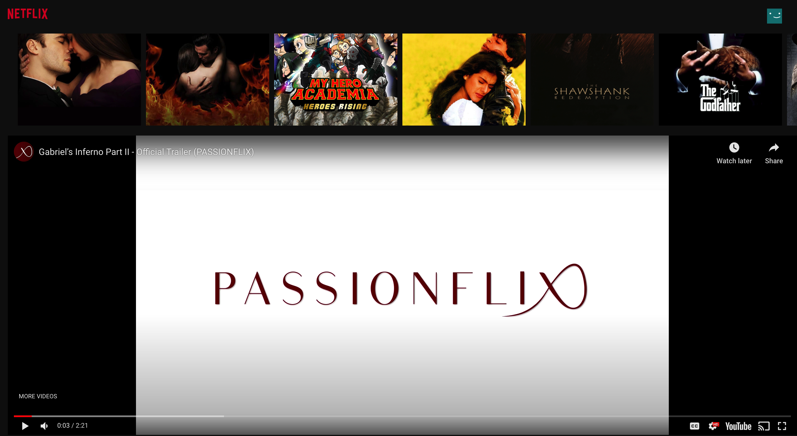

# N E T F L I X - C L O N E


[This React based web app](https://netflix-clone-4b104.web.app/) to demostration Netflix like front-end using [TMDB API endpoints](https://www.themoviedb.org/).

## Usage

1. Clone

   ```bash
   git clone hhttps://github.com/apurva-modi/netflix-clone.git
   ```

2. Install deps (`yarn`, `npm install`)

3. To run it on localhost.

   ```bash
   npm start
   ```

## React Component

These components uses react useState useEffect

- Navbar (ease-in from top on scroll-down)
- Banner (randomly changes on refresh)
- Row (to demonstrate different genre)

Credit: @Clever Programmer on Youtube

# Banner


# Youtube Trailer



# Genre


